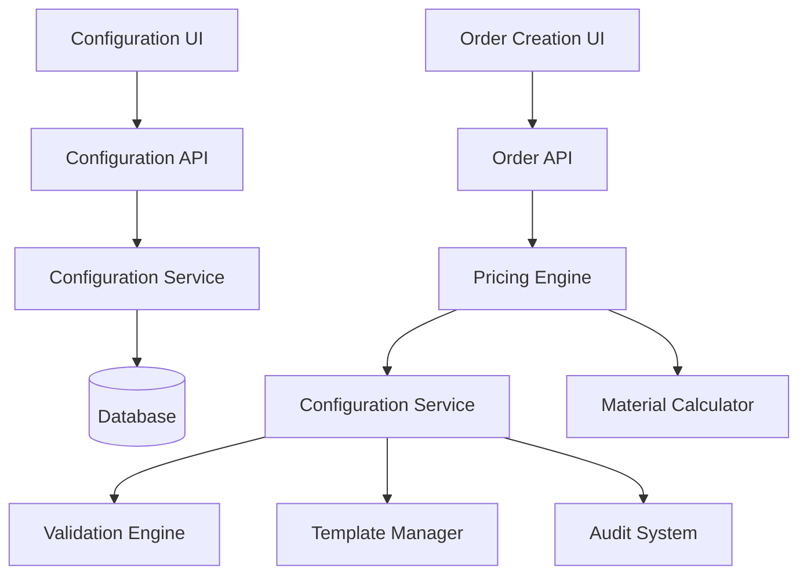
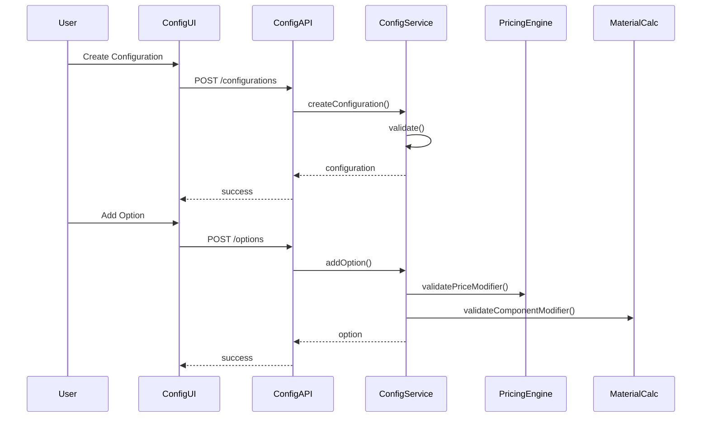

# Design Document - Dynamic Product Configurations

## Overview

The Dynamic Product Configuration system enables products to have customizable options that affect pricing, materials, and production processes. This system transforms static products into flexible, configurable offerings that can adapt to customer needs while maintaining accurate cost calculations and material requirements.

The system builds upon the existing product-material integration and extends it with dynamic configuration capabilities, allowing one base product to serve multiple use cases through selectable options.

## Architecture

### High-Level Architecture



### Component Interaction Flow



## Components and Interfaces

### 1. Configuration Management Components

#### ProductConfigurationManager (Enhanced)
```typescript
interface ProductConfigurationManager {
  // Configuration CRUD
  createConfiguration(productId: string, config: ConfigurationRequest): Promise<Configuration>
  updateConfiguration(configId: string, updates: Partial<ConfigurationRequest>): Promise<Configuration>
  deleteConfiguration(configId: string): Promise<void>
  listConfigurations(productId: string): Promise<Configuration[]>
  
  // Option Management
  addOption(configId: string, option: OptionRequest): Promise<ConfigurationOption>
  updateOption(optionId: string, updates: Partial<OptionRequest>): Promise<ConfigurationOption>
  deleteOption(optionId: string): Promise<void>
  reorderOptions(configId: string, optionIds: string[]): Promise<void>
  
  // Bulk Operations
  duplicateConfiguration(configId: string, targetProductId: string): Promise<Configuration>
  importConfigurations(productId: string, data: ConfigurationImport): Promise<Configuration[]>
  exportConfigurations(productId: string): Promise<ConfigurationExport>
}
```

#### ConfigurationOptionManager (New)
```typescript
interface ConfigurationOptionManager {
  // Option-specific operations
  createOptionWithComponents(configId: string, option: OptionWithComponents): Promise<ConfigurationOption>
  updateOptionComponents(optionId: string, components: ComponentModifier[]): Promise<ConfigurationOption>
  validateOptionCombination(optionIds: string[]): Promise<ValidationResult>
  calculateOptionImpact(optionId: string, quantity: number): Promise<OptionImpact>
  
  // Component modifiers
  addComponentModifier(optionId: string, modifier: ComponentModifier): Promise<void>
  removeComponentModifier(optionId: string, modifierId: string): Promise<void>
  updateComponentModifier(modifierId: string, updates: Partial<ComponentModifier>): Promise<void>
}
```

### 2. Order Integration Components

#### Enhanced AddItemForm
```typescript
interface ConfigurableAddItemForm {
  // Configuration selection
  displayConfigurations(productId: string): Promise<Configuration[]>
  selectConfiguration(configId: string, value: any): Promise<void>
  validateSelections(): Promise<ValidationResult>
  
  // Real-time updates
  updatePricingPreview(): Promise<PricingPreview>
  updateMaterialPreview(): Promise<MaterialPreview>
  
  // Configuration persistence
  saveConfiguredItem(orderItem: ConfiguredOrderItem): Promise<OrderItem>
  loadConfiguredItem(orderItemId: string): Promise<ConfiguredOrderItem>
}
```

#### ConfigurationSelector (New)
```typescript
interface ConfigurationSelector {
  // Rendering different configuration types
  renderSelectConfiguration(config: SelectConfiguration): React.ReactElement
  renderNumberConfiguration(config: NumberConfiguration): React.ReactElement
  renderBooleanConfiguration(config: BooleanConfiguration): React.ReactElement
  renderTextConfiguration(config: TextConfiguration): React.ReactElement
  
  // Validation and feedback
  validateInput(configId: string, value: any): ValidationResult
  showValidationErrors(errors: ValidationError[]): void
  highlightRequiredFields(): void
  
  // User experience
  showPriceImpact(optionId: string): void
  showMaterialImpact(optionId: string): void
  enableDependencyLogic(dependencies: ConfigurationDependency[]): void
}
```

### 3. Backend Services

#### Enhanced ProductConfigurationService
```typescript
class ProductConfigurationService {
  // Core configuration management
  async createConfiguration(productId: string, request: CreateConfigurationRequest): Promise<Configuration>
  async updateConfiguration(configId: string, request: UpdateConfigurationRequest): Promise<Configuration>
  async deleteConfiguration(configId: string): Promise<void>
  async getConfiguration(configId: string): Promise<Configuration>
  async listConfigurations(productId: string): Promise<Configuration[]>
  
  // Option management
  async addOption(configId: string, request: CreateOptionRequest): Promise<ConfigurationOption>
  async updateOption(optionId: string, request: UpdateOptionRequest): Promise<ConfigurationOption>
  async deleteOption(optionId: string): Promise<void>
  async reorderOptions(configId: string, optionIds: string[]): Promise<void>
  
  // Validation
  async validateSelectedConfigurations(productId: string, selections: ConfigurationSelections): Promise<ValidationResult>
  async validateConfigurationIntegrity(configId: string): Promise<IntegrityResult>
  
  // Templates and presets
  async createTemplate(productId: string, templateName: string): Promise<ConfigurationTemplate>
  async applyTemplate(productId: string, templateId: string): Promise<Configuration[]>
  async listTemplates(organizationId: string): Promise<ConfigurationTemplate[]>
  
  // Import/Export
  async exportConfigurations(productId: string): Promise<ConfigurationExport>
  async importConfigurations(productId: string, data: ConfigurationImport): Promise<Configuration[]>
}
```

#### ConfigurationValidationService (New)
```typescript
class ConfigurationValidationService {
  // Validation rules
  async validateRequiredConfigurations(productId: string, selections: ConfigurationSelections): Promise<ValidationResult>
  async validateNumberConstraints(config: NumberConfiguration, value: number): Promise<ValidationResult>
  async validateSelectOptions(config: SelectConfiguration, value: string): Promise<ValidationResult>
  async validateDependencies(productId: string, selections: ConfigurationSelections): Promise<ValidationResult>
  
  // Business rules
  async validateMaterialAvailability(productId: string, selections: ConfigurationSelections): Promise<ValidationResult>
  async validatePricingConstraints(productId: string, selections: ConfigurationSelections): Promise<ValidationResult>
  async validateProductionCapability(productId: string, selections: ConfigurationSelections): Promise<ValidationResult>
  
  // Conflict resolution
  async detectConfigurationConflicts(productId: string, selections: ConfigurationSelections): Promise<ConflictResult>
  async suggestResolutions(conflicts: ConfigurationConflict[]): Promise<ResolutionSuggestion[]>
}
```

### 4. Enhanced Pricing Engine

#### Dynamic Pricing Calculation
```typescript
interface EnhancedPricingEngine {
  // Configuration-aware pricing
  calculateWithConfigurations(input: ConfiguredPricingInput): Promise<ConfiguredPricingOutput>
  
  // Component modifications
  applyComponentModifiers(baseComponents: ProductComponent[], modifiers: ComponentModifier[]): ProductComponent[]
  calculateAdditionalComponents(additionalComponents: AdditionalComponent[]): number
  calculateRemovedComponents(removedComponents: string[], baseComponents: ProductComponent[]): number
  
  // Price modifiers
  applyPriceModifiers(basePrice: number, modifiers: PriceModifier[]): number
  calculateConfigurationSurcharge(selections: ConfigurationSelections): number
  
  // Detailed breakdown
  generatePricingBreakdown(input: ConfiguredPricingInput): Promise<DetailedPricingBreakdown>
}
```

## Data Models

### Enhanced Configuration Models

```typescript
interface Configuration {
  id: string
  productId: string
  name: string
  type: ConfigurationType
  required: boolean
  defaultValue?: string
  affectsComponents: boolean
  affectsPricing: boolean
  
  // Number-specific
  minValue?: number
  maxValue?: number
  step?: number
  
  // Display and ordering
  displayOrder: number
  description?: string
  helpText?: string
  
  // Validation rules
  validationRules?: ValidationRule[]
  dependencies?: ConfigurationDependency[]
  
  // Options (for SELECT type)
  options: ConfigurationOption[]
  
  // Metadata
  createdAt: Date
  updatedAt: Date
  createdBy: string
  version: number
}

interface ConfigurationOption {
  id: string
  configurationId: string
  label: string
  value: string
  description?: string
  
  // Pricing impact
  priceModifier: number
  priceModifierType: 'FIXED' | 'PERCENTAGE'
  
  // Component modifications
  additionalComponents: AdditionalComponent[]
  removedComponents: string[]
  componentModifiers: ComponentModifier[]
  
  // Display and ordering
  displayOrder: number
  icon?: string
  color?: string
  
  // Availability
  isAvailable: boolean
  availabilityConditions?: AvailabilityCondition[]
  
  // Metadata
  createdAt: Date
  updatedAt: Date
}

interface ComponentModifier {
  id: string
  componentId: string
  modificationType: 'MULTIPLY' | 'ADD' | 'REPLACE'
  value: number
  unit?: string
  conditions?: ModifierCondition[]
}

interface AdditionalComponent {
  materialId: string
  consumptionMethod: string
  quantity: number
  wastePercentage: number
  isOptional: boolean
  conditions?: ComponentCondition[]
}
```

### Configuration Selection Models

```typescript
interface ConfigurationSelections {
  [configurationId: string]: any
}

interface ConfiguredOrderItem extends OrderItem {
  configurations: OrderItemConfiguration[]
  configurationHash: string // For caching and validation
  originalPrice: number
  configurationSurcharge: number
  materialModifications: MaterialModification[]
}

interface OrderItemConfiguration {
  id: string
  orderItemId: string
  configurationId: string
  selectedValue: string
  selectedOptionId?: string
  priceImpact: number
  materialImpact: MaterialModification[]
  createdAt: Date
}

interface MaterialModification {
  type: 'ADD' | 'REMOVE' | 'MODIFY'
  materialId: string
  originalQuantity?: number
  newQuantity: number
  reason: string
}
```

### Template and Import/Export Models

```typescript
interface ConfigurationTemplate {
  id: string
  organizationId: string
  name: string
  description?: string
  category: string
  configurations: Configuration[]
  metadata: TemplateMetadata
  createdAt: Date
  updatedAt: Date
  createdBy: string
  usageCount: number
}

interface ConfigurationExport {
  version: string
  productId: string
  productName: string
  exportedAt: Date
  exportedBy: string
  configurations: Configuration[]
  checksum: string
}

interface ConfigurationImport {
  version: string
  configurations: Configuration[]
  options: {
    overwriteExisting: boolean
    preserveIds: boolean
    validateIntegrity: boolean
  }
}
```

## Correctness Properties

*A property is a characteristic or behavior that should hold true across all valid executions of a system-essentially, a formal statement about what the system should do. Properties serve as the bridge between human-readable specifications and machine-verifiable correctness guarantees.*

### Property 1: Configuration Uniqueness
*For any* product, configuration names must be unique within that product's scope
**Validates: Requirements 1.5**

### Property 2: Required Configuration Validation
*For any* order item with a product that has required configurations, all required configurations must have valid selections
**Validates: Requirements 3.2, 6.1**

### Property 3: Price Modifier Consistency
*For any* configuration option with a price modifier, the calculated price must equal base price plus/minus the modifier amount
**Validates: Requirements 4.2**

### Property 4: Material Modification Accuracy
*For any* configuration option that modifies materials, the final material list must accurately reflect additions, removals, and modifications
**Validates: Requirements 5.1, 5.2, 5.3**

### Property 5: Number Configuration Bounds
*For any* NUMBER type configuration with min/max values, selected values must be within the specified bounds
**Validates: Requirements 6.2**

### Property 6: Step Increment Validation
*For any* NUMBER type configuration with a step value, selected values must be valid increments from the minimum value
**Validates: Requirements 6.3**

### Property 7: Select Option Validity
*For any* SELECT type configuration, selected values must correspond to existing option values
**Validates: Requirements 6.4**

### Property 8: Configuration Template Integrity
*For any* configuration template applied to a product, all configurations and options must be successfully created without data loss
**Validates: Requirements 7.3**

### Property 9: Import/Export Round Trip
*For any* product configuration export followed by import, the resulting configurations must be equivalent to the original
**Validates: Requirements 9.3, 9.4**

### Property 10: Pricing Calculation Determinism
*For any* identical set of configuration selections, the pricing calculation must always produce the same result
**Validates: Requirements 4.1, 4.6**

### Property 11: Component Modifier Application
*For any* configuration option with component modifiers, applying the modifiers must result in the correct material quantities
**Validates: Requirements 5.4**

### Property 12: Validation Error Completeness
*For any* invalid configuration selection, the validation system must identify and report all validation errors
**Validates: Requirements 6.6**

## Error Handling

### Configuration Management Errors
- **DuplicateConfigurationNameError**: When attempting to create configurations with duplicate names
- **InvalidConfigurationTypeError**: When configuration type doesn't match expected values
- **ConfigurationNotFoundError**: When referencing non-existent configurations
- **ConfigurationInUseError**: When attempting to delete configurations used in existing orders

### Option Management Errors
- **DuplicateOptionValueError**: When attempting to create options with duplicate values
- **InvalidPriceModifierError**: When price modifiers are outside acceptable ranges
- **ComponentNotFoundError**: When referencing non-existent materials in component modifiers
- **CircularDependencyError**: When configuration dependencies create circular references

### Validation Errors
- **RequiredConfigurationMissingError**: When required configurations are not selected
- **ValueOutOfBoundsError**: When number values exceed min/max constraints
- **InvalidStepIncrementError**: When number values don't match step requirements
- **InvalidOptionSelectionError**: When selected options don't exist
- **ConfigurationConflictError**: When selected configurations create conflicts

### Integration Errors
- **PricingCalculationError**: When pricing calculations fail due to configuration issues
- **MaterialCalculationError**: When material calculations fail due to component modifications
- **OrderSaveError**: When saving configured order items fails
- **TemplateApplicationError**: When applying configuration templates fails

## Testing Strategy

### Unit Testing
- Test individual configuration CRUD operations
- Test option management functionality
- Test validation rules for each configuration type
- Test price modifier calculations
- Test component modifier applications
- Test template creation and application
- Test import/export functionality

### Property-Based Testing
- Generate random configuration combinations and validate pricing consistency
- Generate random component modifications and verify material calculations
- Test configuration validation with various invalid inputs
- Test template round-trip operations with random configurations
- Verify pricing determinism with identical configuration sets

### Integration Testing
- Test complete configuration creation workflow
- Test order creation with configured products
- Test pricing engine integration with configurations
- Test material calculator integration with component modifiers
- Test configuration UI with backend services

### Performance Testing
- Test configuration loading performance with large datasets
- Test pricing calculation performance with complex configurations
- Test material calculation performance with multiple component modifiers
- Test UI responsiveness with many configuration options

### User Acceptance Testing
- Test configuration creation workflow with real users
- Test order creation with configured products
- Test configuration template usage
- Test import/export functionality
- Test error handling and user feedback

## Implementation Notes

### Database Considerations
- Add indexes on frequently queried configuration fields
- Implement soft deletes for configurations to preserve order history
- Use JSON fields for flexible component modifier storage
- Consider partitioning for large configuration datasets

### Performance Optimizations
- Cache frequently accessed configurations
- Implement lazy loading for configuration options
- Use database views for complex configuration queries
- Implement configuration change notifications to invalidate caches

### Security Considerations
- Validate all configuration inputs to prevent injection attacks
- Implement proper authorization for configuration management
- Audit all configuration changes for compliance
- Sanitize configuration data before storage and display

### Scalability Considerations
- Design for horizontal scaling of configuration services
- Implement configuration versioning for backward compatibility
- Use event-driven architecture for configuration change notifications
- Consider microservice architecture for large-scale deployments