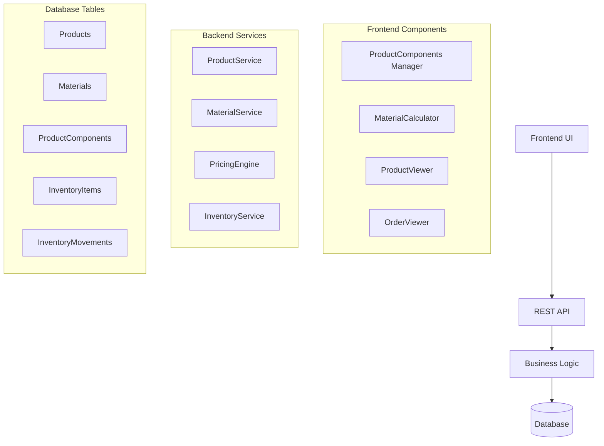

# Design Document: Product-Material Integration

## Overview

Este documento descreve o design para implementar um sistema completo de vinculação entre produtos e materiais, permitindo configuração de componentes, cálculo automático de custos e consumo, e gerenciamento de estoque integrado.

O sistema permitirá que produtos sejam configurados com seus materiais constituintes, cada um com seu método de consumo específico e percentual de perda, possibilitando cálculos precisos de custo e verificação de disponibilidade de estoque.

## Architecture

### High-Level Architecture



### Data Flow

1. **Product Configuration**: Admin configura materiais para produtos
2. **Order Creation**: Sistema calcula materiais necessários baseado nos produtos
3. **Material Calculation**: MaterialCalculator usa dados reais dos componentes
4. **Inventory Check**: Sistema verifica disponibilidade em tempo real
5. **Material Reservation**: Materiais são reservados quando pedidos são aprovados

## Components and Interfaces

### 1. ProductComponentManager (Frontend)

**Responsabilidade**: Interface para gerenciar componentes de materiais em produtos

**Props**:
```typescript
interface ProductComponentManagerProps {
  productId: string;
  components: ProductComponent[];
  onComponentAdd: (component: CreateComponentRequest) => void;
  onComponentRemove: (componentId: string) => void;
  onComponentUpdate: (componentId: string, data: UpdateComponentRequest) => void;
}
```

**Key Features**:
- Lista componentes existentes
- Modal para adicionar novos materiais
- Validação de métodos de consumo
- Interface para configurar percentual de perda

### 2. MaterialSelector (Frontend)

**Responsabilidade**: Modal para seleção de materiais com filtros

**Props**:
```typescript
interface MaterialSelectorProps {
  isOpen: boolean;
  onClose: () => void;
  onSelect: (material: Material, config: ComponentConfig) => void;
  excludeIds?: string[];
}
```

**Key Features**:
- Filtro por nome, formato e disponibilidade
- Seleção de método de consumo
- Configuração de percentual de perda
- Validação de compatibilidade

### 3. Enhanced MaterialCalculator (Frontend)

**Responsabilidade**: Cálculo real de materiais baseado em componentes configurados

**Props**:
```typescript
interface MaterialCalculatorProps {
  productId: string;
  width: number;
  height: number;
  quantity: number;
  onCalculationComplete?: (result: MaterialCalculationResult) => void;
}
```

**Key Features**:
- Busca componentes reais do produto
- Cálculo baseado em métodos configurados
- Verificação de estoque real
- Sugestão de materiais alternativos

### 4. ProductComponentService (Backend)

**Responsabilidade**: Gerenciamento de componentes de produto

**Interface**:
```typescript
interface ProductComponentService {
  addComponent(productId: string, request: CreateComponentRequest): Promise<ProductComponent>;
  removeComponent(productId: string, componentId: string): Promise<void>;
  listComponents(productId: string): Promise<ProductComponent[]>;
  updateComponent(componentId: string, data: UpdateComponentRequest): Promise<ProductComponent>;
  validateComponentCompatibility(materialId: string, consumptionMethod: string): Promise<boolean>;
}
```

### 5. Enhanced PricingEngine (Backend)

**Responsabilidade**: Cálculo de preços usando componentes reais

**Interface**:
```typescript
interface EnhancedPricingEngine {
  calculateWithRealComponents(input: PricingInput): Promise<PricingOutput>;
  validateProductConfiguration(productId: string): Promise<ValidationResult>;
  getComponentCosts(productId: string, dimensions: Dimensions, quantity: number): Promise<ComponentCost[]>;
}
```

### 6. MaterialReservationService (Backend)

**Responsabilidade**: Gerenciamento de reservas de materiais

**Interface**:
```typescript
interface MaterialReservationService {
  reserveMaterials(orderId: string): Promise<ReservationResult>;
  cancelReservations(orderId: string): Promise<void>;
  checkAvailability(requirements: MaterialRequirement[]): Promise<AvailabilityCheck>;
  suggestAlternatives(materialId: string, quantity: number): Promise<Material[]>;
}
```

## Data Models

### ProductComponent (Enhanced)

```typescript
interface ProductComponent {
  id: string;
  productId: string;
  materialId: string;
  consumptionMethod: 'BOUNDING_BOX' | 'LINEAR_NEST' | 'FIXED_AMOUNT';
  wastePercentage: number; // Calculado automaticamente baseado no histórico
  calculatedWastePercentage: number; // Percentual calculado baseado nas perdas registradas
  manualWastePercentage?: number; // Permite override manual se necessário
  lastWasteUpdate: Date; // Quando foi atualizado pela última vez
  wasteCalculationPeriod: number; // Período em dias para cálculo (ex: 90 dias)
  isOptional: boolean;
  priority: number; // Para ordenação
  notes?: string;
  
  // Relacionamentos
  product: Product;
  material: Material;
  
  // Timestamps
  createdAt: Date;
  updatedAt: Date;
}

// Nova tabela para registrar perdas reais na produção
interface ProductionWaste {
  id: string;
  orderId: string;
  productId: string;
  materialId: string;
  componentId: string; // Referência ao ProductComponent
  plannedQuantity: number;
  actualQuantity: number;
  wasteQuantity: number;
  wasteReason: string; // "Erro de impressão", "Problema na máquina", etc.
  reportedBy: string;
  reportedAt: Date;
}
```

### MaterialRequirement

```typescript
interface MaterialRequirement {
  materialId: string;
  quantityNeeded: number;
  unit: string;
  consumptionMethod: string;
  wastePercentage: number;
  cost: number;
  available: number;
  sufficient: boolean;
  alternatives?: Material[];
}
```

### MaterialCalculationResult

```typescript
interface MaterialCalculationResult {
  productId: string;
  requirements: MaterialRequirement[];
  totalCost: number;
  warnings: string[];
  canProduce: boolean;
  suggestedAlternatives: MaterialAlternative[];
}
```

### ReservationResult

```typescript
interface ReservationResult {
  orderId: string;
  reservations: MaterialReservation[];
  totalReserved: number;
  failures: ReservationFailure[];
  success: boolean;
}
```

## Correctness Properties

*A property is a characteristic or behavior that should hold true across all valid executions of a system-essentially, a formal statement about what the system should do. Properties serve as the bridge between human-readable specifications and machine-verifiable correctness guarantees.*

### Property 1: Component Addition Consistency
*For any* valid product and material combination, adding a component should create a ProductComponent record and update the product's component list
**Validates: Requirements 1.2, 1.5**

### Property 2: Material Validation Rules
*For any* consumption method and material format combination, the system should only allow compatible pairings (BOUNDING_BOX with SHEET, LINEAR_NEST with ROLL, FIXED_AMOUNT with any)
**Validates: Requirements 2.4, 10.4**

### Property 3: Component Removal Consistency
*For any* existing ProductComponent, removing it should delete the record and update the product's component list
**Validates: Requirements 1.3**

### Property 4: Dynamic Engineer Validation
*For any* product with DYNAMIC_ENGINEER pricing mode, the system should require at least one material component
**Validates: Requirements 1.4**

### Property 5: Material Filtering Accuracy
*For any* search criteria (name, format, availability), the material filter should return only materials matching all specified criteria
**Validates: Requirements 2.2**

### Property 6: Real Component Calculation
*For any* product with configured components, the MaterialCalculator should calculate consumption using only the linked materials and their configured methods
**Validates: Requirements 3.1, 3.2**

### Property 7: Stock Verification Accuracy
*For any* material requirement, the system should verify against real inventory levels and flag insufficient stock
**Validates: Requirements 3.4, 7.1**

### Property 8: Material Display Completeness
*For any* order item with a configured product, the system should display all required materials with calculated quantities and costs
**Validates: Requirements 4.1, 4.2**

### Property 9: API Component Operations
*For any* valid component operation (add, remove, list), the API should perform the operation and return appropriate success or error responses
**Validates: Requirements 5.1, 5.2, 5.3, 5.5**

### Property 10: Material Existence Validation
*For any* component creation request, the system should verify the material exists before creating the ProductComponent
**Validates: Requirements 5.4**

### Property 11: PricingEngine Component Integration
*For any* DYNAMIC_ENGINEER product, the PricingEngine should use only configured components for cost calculation
**Validates: Requirements 6.1, 6.2**

### Property 12: Waste Percentage Application
*For any* material component with configured waste percentage, the consumption calculation should include the waste factor
**Validates: Requirements 6.4**

### Property 13: Cost Summation Accuracy
*For any* product calculation, the PricingEngine should sum all material costs and operation costs correctly
**Validates: Requirements 6.5**

### Property 14: Order Material Verification
*For any* order creation, the system should calculate total material consumption across all items and verify availability
**Validates: Requirements 7.1, 7.2**

### Property 15: Alternative Material Suggestions
*For any* insufficient material, the system should suggest compatible alternatives when available
**Validates: Requirements 7.4**

### Property 16: Material Reservation Consistency
*For any* approved order, reserving materials should create RESERVED inventory movements and update availability
**Validates: Requirements 8.1, 8.2, 8.3**

### Property 17: Reservation Cancellation
*For any* cancelled order with reservations, the system should reverse the reservations and restore availability
**Validates: Requirements 8.4**

### Property 18: Reserved Material Display
*For any* material with reservations, the inventory view should show reserved quantities separately from available quantities
**Validates: Requirements 8.5**

### Property 19: Consumption Report Accuracy
*For any* time period, the consumption report should accurately calculate material usage based on completed orders
**Validates: Requirements 9.1, 9.3**

### Property 20: Waste Analysis Calculation
*For any* material usage data, the system should identify materials with highest waste percentages
**Validates: Requirements 9.4**

### Property 21: Report Export Functionality
*For any* generated report, the system should allow export to Excel format with all data intact
**Validates: Requirements 9.5**

### Property 22: Consumption Method Configuration
*For any* material format, the system should allow only compatible consumption methods to be configured
**Validates: Requirements 10.1, 10.2, 10.3, 10.4**

### Property 23: Waste Percentage Validation
*For any* component configuration, the system should accept waste percentages between 0% and 100%
**Validates: Requirements 10.5**

## Error Handling

### Validation Errors
- **Invalid Material-Method Combination**: Return specific error when incompatible consumption method is selected
- **Missing Components**: Error when DYNAMIC_ENGINEER product has no materials configured
- **Insufficient Stock**: Warning (not error) when materials are insufficient, allow order creation with alert

### API Errors
- **404 Not Found**: When product or material doesn't exist
- **409 Conflict**: When trying to add duplicate component
- **400 Bad Request**: For invalid consumption methods or percentages

### Calculation Errors
- **No Components Configured**: Return informative message instead of calculation
- **Invalid Dimensions**: Handle zero or negative dimensions gracefully
- **Missing Material Data**: Skip materials with incomplete data, log warning

### Reservation Errors
- **Partial Reservation Failure**: Allow partial reservations, report failures
- **Concurrent Reservation**: Handle race conditions with optimistic locking
- **Insufficient Stock**: Allow reservation with backorder flag

## Testing Strategy

### Unit Tests
- Component CRUD operations
- Material calculation algorithms
- Validation rules for consumption methods
- Error handling scenarios
- API endpoint responses

### Property-Based Tests
Each correctness property will be implemented as a property-based test with minimum 100 iterations:

- **Property 1-23**: Each property will be tested with randomly generated valid inputs
- **Tag Format**: `Feature: product-material-integration, Property {number}: {property_text}`
- **Test Framework**: Jest with fast-check for property-based testing

### Integration Tests
- End-to-end component management workflow
- Material calculation with real database data
- Order creation with material verification
- Reservation and cancellation flows

### Performance Tests
- Material calculation with large product catalogs
- Bulk reservation operations
- Report generation with extensive data

The testing approach ensures both specific examples work correctly (unit tests) and universal properties hold across all inputs (property tests), providing comprehensive coverage of the material integration system.