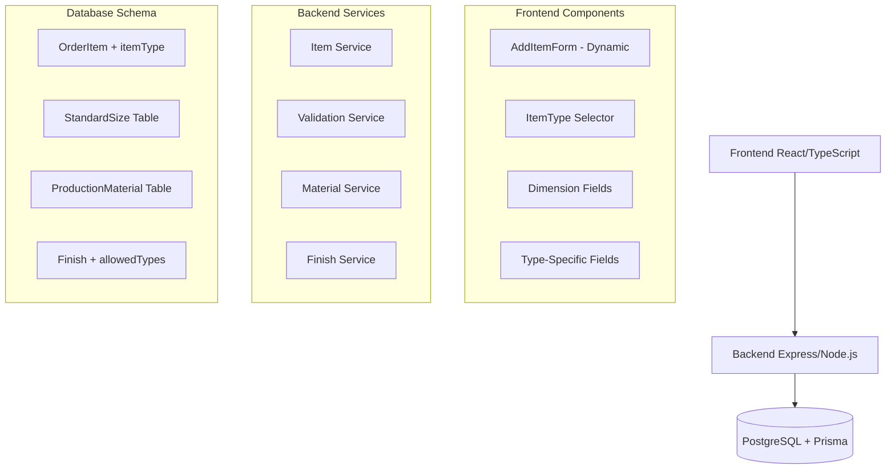

# Design Document - Tipos de Produtos

## Overview

Este documento detalha o design para implementar a funcionalidade de "Tipos de Produtos" no ArtPlimERP. A solução permitirá diferenciar entre diferentes tipos de trabalhos gráficos (Serviços, Impressão, Corte a Laser) com formulários dinâmicos e validações específicas por tipo.

## Architecture

### High-Level Architecture



### Data Flow

1. **Type Selection**: User selects ItemType → Frontend shows relevant fields
2. **Form Validation**: Type-specific validation rules applied
3. **Data Submission**: Form data packed into attributes JSON
4. **Backend Processing**: Validation and storage with type-specific logic
5. **Display**: Type-aware rendering of item information

## Components and Interfaces

### Database Schema Changes

#### New Enum: ItemType
```prisma
enum ItemType {
  PRODUCT      // Produto padrão/revenda (default)
  SERVICE      // Arte/Design/Mão de obra
  PRINT_SHEET  // Impressão em papel/folha
  PRINT_ROLL   // Banner/Adesivo/Lona
  LASER_CUT    // Corte/Gravação a laser
}
```

#### Updated OrderItem and QuoteItem
```prisma
model OrderItem {
  // ... existing fields ...
  
  // New fields for product types
  itemType     ItemType @default(PRODUCT)
  width        Decimal? @db.Decimal(10,3)  // mm
  height       Decimal? @db.Decimal(10,3)  // mm  
  totalArea    Decimal? @db.Decimal(10,6)  // m² (cached)
  attributes   Json?    // Type-specific data
  
  // ... rest of existing fields ...
}
```

#### New Table: StandardSize
```prisma
model StandardSize {
  id           String   @id @default(uuid())
  name         String   // "A4", "Cartão de Visita", etc.
  width        Decimal  @db.Decimal(10,3) // mm
  height       Decimal  @db.Decimal(10,3) // mm
  type         ItemType
  companyId    String
  company      Organization @relation(fields: [companyId], references: [id])
  
  createdAt    DateTime @default(now())
  updatedAt    DateTime @updatedAt
  
  @@map("standard_sizes")
}
```

#### New Table: ProductionMaterial
```prisma
model ProductionMaterial {
  id           String   @id @default(uuid())
  name         String   // "MDF 3mm", "Lona 440g", etc.
  type         ItemType
  costPrice    Decimal  @db.Decimal(10,4)
  salesPrice   Decimal  @db.Decimal(10,4)
  properties   Json?    // {"thickness": 3, "weight": 440}
  companyId    String
  company      Organization @relation(fields: [companyId], references: [id])
  
  active       Boolean  @default(true)
  createdAt    DateTime @default(now())
  updatedAt    DateTime @updatedAt
  
  @@map("production_materials")
}
```

#### Updated Finish Table
```prisma
model Finish {
  // ... existing fields ...
  allowedTypes ItemType[] // Array of compatible types
  // ... rest of existing fields ...
}
```

### Frontend Components

#### Enhanced AddItemForm Component
```typescript
interface ItemFormData {
  itemType: ItemType;
  productId: string;
  quantity: number;
  
  // Conditional fields based on type
  width?: number;
  height?: number;
  totalArea?: number;
  
  // Type-specific attributes
  attributes: {
    // SERVICE
    description?: string;
    briefing?: string;
    
    // PRINT_SHEET
    paperSize?: string;
    paperType?: string;
    printColors?: string;
    finishing?: string;
    
    // PRINT_ROLL
    material?: string;
    finishes?: string[];
    
    // LASER_CUT
    material?: string;
    machineTimeMinutes?: number;
    vectorFile?: string;
  };
}
```

#### Dynamic Form Renderer
```typescript
const renderFieldsByType = (itemType: ItemType) => {
  switch (itemType) {
    case 'SERVICE':
      return <ServiceFields />;
    case 'PRINT_SHEET':
      return <PrintSheetFields />;
    case 'PRINT_ROLL':
      return <PrintRollFields />;
    case 'LASER_CUT':
      return <LaserCutFields />;
    default:
      return <ProductFields />;
  }
};
```

### Backend Services

#### Item Validation Service
```typescript
class ItemValidationService {
  validateByType(itemType: ItemType, data: any): ValidationResult {
    const schema = this.getSchemaForType(itemType);
    return this.validate(data, schema);
  }
  
  private getSchemaForType(type: ItemType): ValidationSchema {
    // Return type-specific validation rules
  }
}
```

#### Material Service
```typescript
class MaterialService {
  async getMaterialsByType(type: ItemType, companyId: string): Promise<ProductionMaterial[]> {
    return this.repository.findByType(type, companyId);
  }
}
```

## Data Models

### Attribute Schemas by Type

#### SERVICE Attributes
```json
{
  "description": "string (required)",
  "briefing": "string (optional)",
  "estimatedHours": "number (optional)",
  "skillLevel": "enum: basic|intermediate|advanced (optional)"
}
```

#### PRINT_SHEET Attributes
```json
{
  "paperSize": "string (required)",
  "paperType": "string (required)", 
  "printColors": "string (required)",
  "finishing": "string (optional)",
  "sides": "enum: front|both (derived from printColors)"
}
```

#### PRINT_ROLL Attributes
```json
{
  "material": "string (required)",
  "finishes": "string[] (optional)",
  "installationType": "enum: indoor|outdoor (optional)",
  "windResistance": "boolean (optional)"
}
```

#### LASER_CUT Attributes
```json
{
  "material": "string (required)",
  "machineTimeMinutes": "number (optional)",
  "vectorFile": "string (optional)",
  "cutType": "enum: cut|engrave|both (optional)",
  "thickness": "number (optional)"
}
```

## Correctness Properties

*A property is a characteristic or behavior that should hold true across all valid executions of a system-essentially, a formal statement about what the system should do. Properties serve as the bridge between human-readable specifications and machine-verifiable correctness guarantees.*

### Property 1: ItemType Enum Validation
*For any* item creation or update request, the itemType field should only accept values from the defined ItemType enum (PRODUCT, SERVICE, PRINT_SHEET, PRINT_ROLL, LASER_CUT)
**Validates: Requirements 1.1, 1.4**

### Property 2: Default ItemType Assignment
*For any* item created without specifying itemType, the system should automatically assign PRODUCT as the default value
**Validates: Requirements 1.3**

### Property 3: Dimensional Field Requirements
*For any* item with type PRINT_SHEET, PRINT_ROLL, or LASER_CUT, width and height fields should be required and greater than zero
**Validates: Requirements 2.2, 7.2**

### Property 4: Service Type Dimension Exemption
*For any* item with type SERVICE, width and height fields should not be required and can be null
**Validates: Requirements 7.1**

### Property 5: Area Calculation Accuracy
*For any* item with valid width and height values, the totalArea should equal (width × height) / 1,000,000 in square meters
**Validates: Requirements 2.3, 9.1**

### Property 6: Total Area Calculation
*For any* item with area and quantity, the total area should equal (area × quantity)
**Validates: Requirements 9.2**

### Property 7: Attributes JSON Structure Validation
*For any* item type, the attributes JSON should conform to the predefined schema for that specific type
**Validates: Requirements 2.4, 2.5, 10.4**

### Property 8: Standard Size Filtering
*For any* request for standard sizes with a specific ItemType, only sizes matching that type should be returned
**Validates: Requirements 3.2**

### Property 9: Standard Size Auto-Population
*For any* selected standard size, the width and height fields should be automatically populated with the size's dimensions
**Validates: Requirements 3.3**

### Property 10: Material Type Filtering
*For any* request for materials with a specific ItemType, only materials compatible with that type should be returned
**Validates: Requirements 4.2**

### Property 11: Finish Type Compatibility
*For any* finish selection, only finishes that include the current ItemType in their allowedTypes array should be available
**Validates: Requirements 5.2, 5.3**

### Property 12: Finish Backward Compatibility
*For any* finish without specified allowedTypes, it should be available for all ItemType values
**Validates: Requirements 5.5**

### Property 13: Form Field Visibility by Type
*For any* ItemType selection, only the appropriate form fields should be visible (SERVICE shows description/value, dimensional types show width/height/materials)
**Validates: Requirements 6.1, 6.2, 6.3**

### Property 14: Attributes Data Packing
*For any* form submission, type-specific form data should be correctly packed into the attributes JSON field
**Validates: Requirements 6.5**

### Property 15: Data Migration Integrity
*For any* existing OrderItem or QuoteItem, the migration should preserve all original data while adding itemType as PRODUCT
**Validates: Requirements 8.2, 8.3**

### Property 16: Type-Specific Attribute Storage
*For any* item type (SERVICE, LASER_CUT, PRINT_ROLL), the system should correctly store and retrieve type-specific attributes in JSON format
**Validates: Requirements 10.1, 10.2, 10.3**

### Property 17: JSON Attribute Querying
*For any* search or filter operation on attributes, the system should be able to query JSON content effectively
**Validates: Requirements 10.5**

## Error Handling

### Validation Errors
- **Invalid ItemType**: Return 400 with specific enum values allowed
- **Missing Required Dimensions**: Return 400 with field requirements by type
- **Invalid Attributes Schema**: Return 400 with schema validation details
- **Incompatible Material/Finish**: Return 400 with compatibility information

### Migration Errors
- **Schema Update Failures**: Rollback mechanism for database changes
- **Data Conversion Issues**: Detailed logging and manual intervention procedures
- **Constraint Violations**: Clear error messages for data integrity issues

### Frontend Error Handling
- **Type Selection Changes**: Clear dependent fields when type changes
- **Validation Feedback**: Real-time validation with clear error messages
- **Network Errors**: Graceful degradation and retry mechanisms

## Testing Strategy

### Unit Testing
- **Validation Logic**: Test each ItemType validation schema
- **Calculation Functions**: Test area calculations with various inputs
- **Component Rendering**: Test form field visibility by type
- **Data Transformation**: Test attributes JSON packing/unpacking

### Property-Based Testing
- **Enum Validation**: Generate random ItemType values and validate acceptance/rejection
- **Dimension Calculations**: Generate random dimensions and verify area calculations
- **Attribute Schemas**: Generate random attribute data and validate against schemas
- **Type Filtering**: Generate random type/material combinations and verify filtering

### Integration Testing
- **Database Operations**: Test CRUD operations with new schema
- **API Endpoints**: Test type-specific validation and responses
- **Form Workflows**: Test complete user workflows for each type
- **Migration Scripts**: Test data migration with sample datasets

### Configuration
- Minimum 100 iterations per property test
- Each property test tagged with: **Feature: tipos-produtos, Property {number}: {property_text}**
- Use Jest with @fast-check/jest for property-based testing
- Mock external dependencies for isolated testing